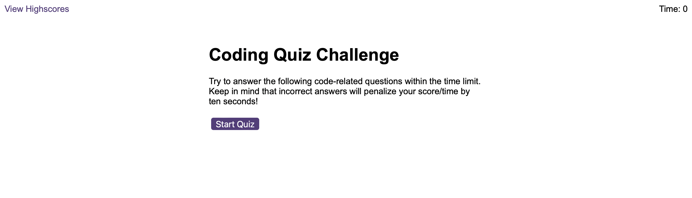
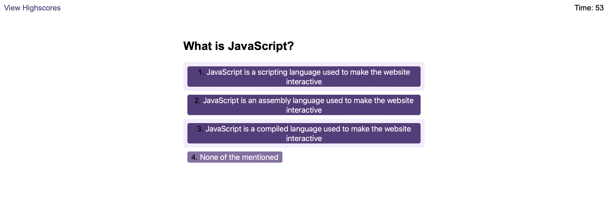
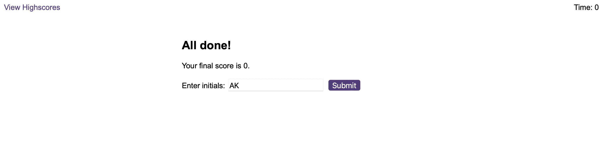
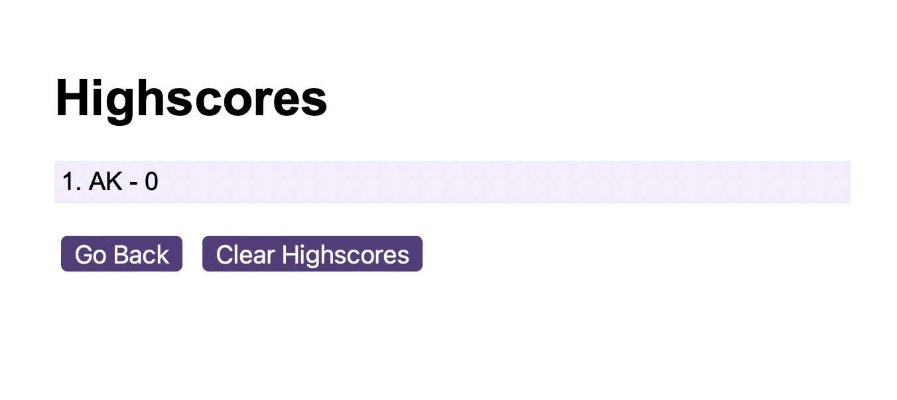

# Code Quiz Game

## Description

A quiz game in which player answers as many code related questions as they can before the time runs out!

As the users goes through and answers questions their score is saved to users browser memory. Saved score is used to populate a Highscores page, there is also an option to clear all previous scores and start fresh.

## Installation

N/A

## Credits

N/A

## License

Please refer to the LICENSE in the repo.

## Languages used

